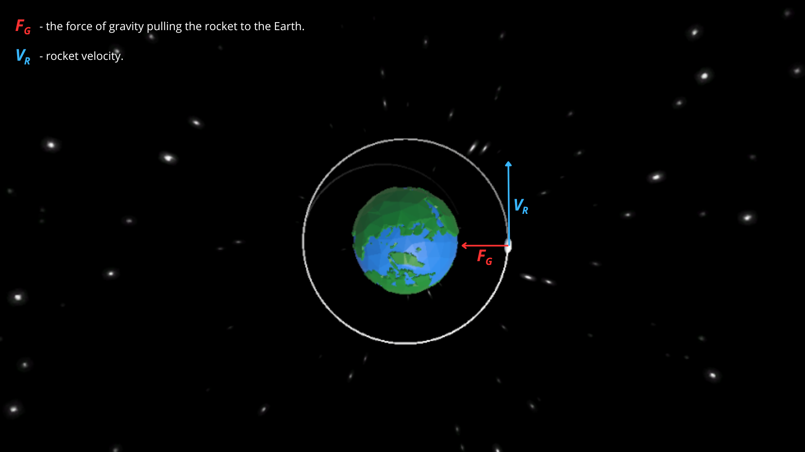
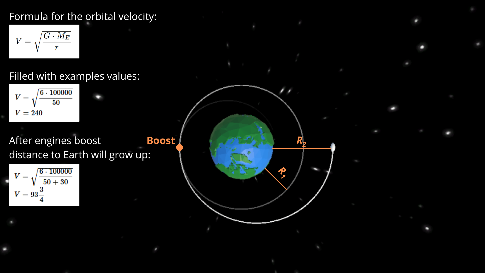

# 🚀 Rocket Orbiting Simulator

## 📃 Brief description
A simulator designed to model rocket movement within the framework of orbital mechanics. Built using the Unity game engine, it provides accurate visualizations and calculations of rocket trajectories by implementing the true laws of physics governing motion in space. This project leverages the power of C# and Unity to create an interactive experience for users.

## 🌐 Website
Try my project online on this website: https://szymonmachnik.itch.io/rocket-orbiting-simulator!

## 🛠️ How it works? (Explanation from physics point of view)
### Moving on orbit

The image illustrates the forces acting on a rocket in Earth's orbit. The red vector 𝐹𝐺 represents the gravitational force pulling the rocket toward the Earth, while the blue vector 𝑉𝑅 indicates the rocket's velocity tangent to its orbital path. The combined interaction of these, well balanced, forces results in the stable orbital motion depicted by the circular trajectory around the Earth.

### Speed up to go slower, slow down to faster?

As we see in the image above, if we use engines distance to Earth will increase, but rocket velocity decrease.

## 💻 Tech Stack
### Programming language:
  - C#.
### Engine:
  - Unity 6.

## 📒 To-Do
### - Add a graphical effect when the engines are used.
### - Add orbit inclination.
### - Add transfers that let the user to change orbit inclination.

## 📘 Last update
### 30.12.2024 - Added two additional cameras.
